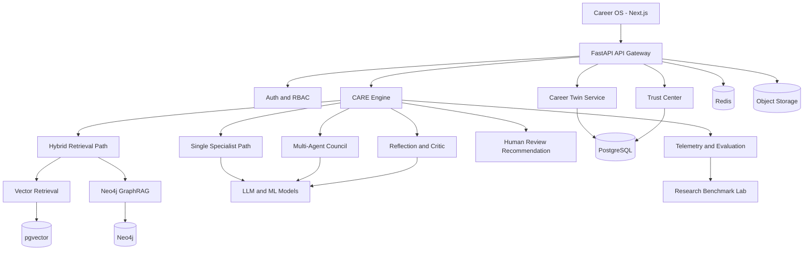
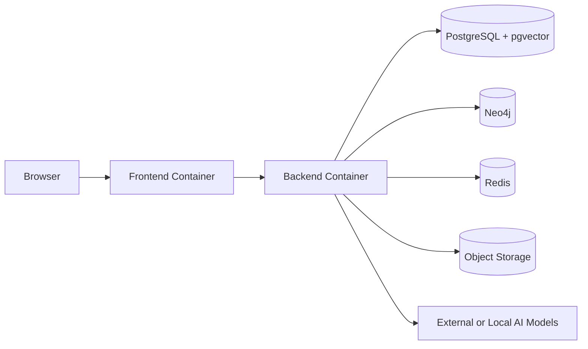

# System Architecture

## Logical Architecture

## Primary Components

### Career OS Frontend
- Dashboard
- Career Twin graph
- Resume intelligence
- Assessment experience
- Interview Arena
- Experiment Lab
- Trust Center
- Research dashboard

### FastAPI Backend
- API validation
- Authentication
- Domain services
- WebSocket/SSE streaming
- File processing
- Agent orchestration

### CARE Engine
Calculates the minimum sufficient reasoning path based on evidence sufficiency, confidence, disagreement, risk, and task type.

### Career Twin Service
Maintains the current state and immutable update history for each student.

### Retrieval Layer
- pgvector: semantic retrieval
- Neo4j: relationship/path retrieval
- Hybrid ranker: combines graph and vector evidence

### Trust Layer
Stores evidence, confidence, provenance, reasoning summaries, decision traces, model versions, and review status.

## Deployment Topology

