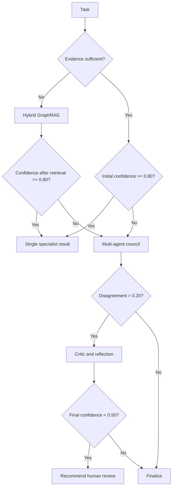

# CARE Engine Specification

## Name

**CARE — Confidence-Aware Reasoning and Escalation**

## Purpose

Use the least expensive reasoning path that can still produce a sufficiently reliable result.

## Inputs

- Task type
- Task risk
- Evidence count
- Evidence quality
- Retrieval coverage
- Initial confidence
- Agent disagreement
- Student history consistency
- Model health and availability

## Initial Routing Policy

| Condition | Route |
|---|---|
| Confidence ≥ 0.80 and evidence sufficient | Single specialist |
| Confidence 0.55–0.79 or evidence incomplete | Hybrid GraphRAG retrieval |
| Conflicting evidence or confidence < 0.55 | Multi-agent council |
| Agent disagreement > 0.20 | Critic/reflection pass |
| Final confidence < 0.50 or high-risk ambiguity | Human-review recommendation |

Thresholds are hypotheses and must be tuned through evaluation.

## Decision Flow



## Required Output

```json
{
  "route": "hybrid_retrieval_then_multi_agent",
  "confidence": 0.76,
  "evidence_ids": [],
  "agents_invoked": [],
  "agreement": 0.81,
  "reasoning_summary": "Conflicting resume and assessment evidence required specialist review.",
  "requires_human_review": false
}
```

## Safety Rule

CARE must not present a high-confidence score when evidence is missing, stale, contradictory, or produced by an unavailable subsystem.
